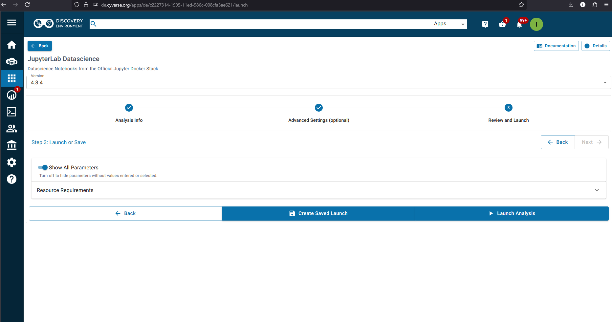
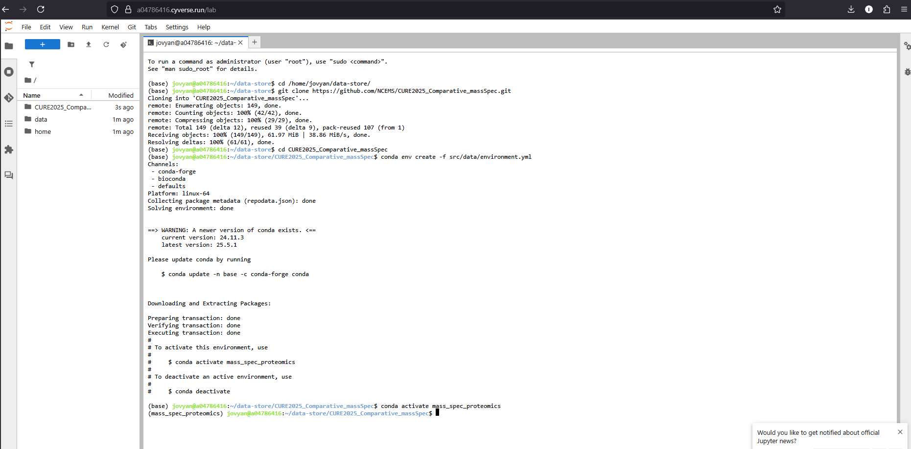

# CURE2025_Comparative_massSpec

## Overview

This repository contains a comprehensive Jupyter notebook for **Processing Mass Spectrometry Proteomics Data**. The notebook provides an in-depth tutorial on mass spectrometry fundamentals and hands-on analysis of proteomics datasets from two different organisms:

- **Soybean (*Glycine max*)** - Label-free quantification (LFQ) analysis of phosphate stress response
- **Human (*Homo sapiens*)** - SILAC-labeled analysis of hypoxia-induced pulmonary fibrosis

### What You'll Learn

- Fundamentals of mass spectrometry and proteomics workflows
- How to process raw mass spectrometry data using SAGE (Spectral Alignment Guided Engine)
- Peptide identification and protein quantification techniques
- Statistical analysis of differential protein expression
- Data visualization and interpretation of proteomics results

## Prerequisites

- Basic knowledge of Python programming
- Understanding of biological concepts (proteins, enzymes, cellular processes)
- Familiarity with command-line operations (helpful but not required)
- A CyVerse account ([Sign-up here](https://user.cyverse.org/signup))
- A GitHub account ([Sign-up here](https://github.com/))

## Getting Started with CyVerse: Accessing the Discovery Environment & Launching JupyterLab

### 1. **Log in to CyVerse**

1. Open a web browser and go to: `https://user.cyverse.org`
   *(You can tell them to bookmark it.)*
2. Click **“Log In”**.
3. Authenticate using your CyVerse credentials.

   * If this is your first time, you may need to activate your account via the email CyVerse sent.
   * If prompted, complete any multi-factor authentication (MFA) steps (e.g., one-time code or Duo) depending on your institution’s setup.

### 2. **Navigate to the Discovery Environment**

1. After successful login, you’ll be on the CyVerse [Services](https://user.cyverse.org/services) page.


2. In the *My Services* part of the page find and click **“Discovery Environment”**.  
3. The Discovery Environment interface will load a sub window highlighting its key features. Click the `Luanch` button in the upper right corner to go to the Discovery Environment.  
    * This is where you can browse your data, run analyses, and launch apps.


### 3. **Locate and Launch the JupyterLab\_Datascience\_analysis1 App**

1. Inside the Discovery Environment, take some time too look at the Resource Usage dashboard. 
    * This tracks how much storage and compute power you have used. 
2. Go to the task bar on the left side of the screen and click the Apps icon (a square made of 9 smaller squares).
    * This will open up the *Featured Apps* list where you can choose popular Applications. 


  
3. Look for the app called `JupyterLab Datascience` and click it. 
    * This will launch a dashboard to get some configuration information from you before starting the session on the HPC. 

4. The *Analysis info* section can be left as is. Click Next -->  


5. The *Advanced settings* section select the following:
    * CPU Cores = 4
    * Minimum Memory = 32 GiB
    * Minimum Disk Space = 64 Gib  


6. On the *Review and Launch* Click Launch Analysis -->
    * This will take a min or two to launch initially. 
    * If you are not directly launched into the session and instead brought to a summary page of the analysis, click the `Go to Analysis` button at the top of the page.    
  
   
7. Your inital session view will contain a file browser on your left and a launcher area on the right. 


8. Click the terminal icon in the launcher area to open up a command line interface. 


9. Enter the following commands into the shell. 
```bash
cd /home/jovyan/data-store/

# Clone the github repository
git clone https://github.com/NCEMS/CURE2025_Comparative_massSpec.git

# Navigate to the project directory
cd CURE2025_Comparative_massSpec

# Create the conda environment
conda env create -f src/data/environment.yml

# Activate the environment
conda activate mass_spec_proteomics
```

10. Navigate to the Jupyter note book called `Processing_Mass_Spectrometry_Proteomics_Data.ipynb` in the `CURE2025_Comparative_massSpec/src/data/` directory using the file browser on the left hand side of the session window. Double click the notebook to open it and you should see a screen like below. 


## Jupyter Notebook Tutorial

### Getting Started with Jupyter

1. **Opening the Notebook**
   - Navigate to `src/data/Processing_Mass_Spectrometry_Proteomics_Data.ipynb`
   - Click on the file to open it

2. **Understanding Cell Types**
   - **Markdown cells**: Contain text, explanations, and formatted content
   - **Code cells**: Contain Python code that can be executed

### Navigation Basics

- **Moving between cells**: Use arrow keys or click on cells
- **Cell selection**: Click on a cell to select it (blue border = selected, green border = edit mode)
- **Enter edit mode**: Press `Enter` or double-click on a cell
- **Exit edit mode**: Press `Esc`

### Running Cells

- **Run current cell**: Press `Shift + Enter` (runs cell and moves to next)
- **Run current cell (stay)**: Press `Ctrl + Enter` (runs cell but stays on current cell)
- **Run all cells**: Menu > Cell > Run All
- **Run cells above**: Menu > Cell > Run All Above
- **Run cells below**: Menu > Cell > Run All Below

### Keyboard Shortcuts (Command Mode)

When a cell is selected but not in edit mode (blue border):

- `A` - Insert cell above
- `B` - Insert cell below
- `DD` - Delete cell (press D twice)
- `M` - Change cell to Markdown
- `Y` - Change cell to Code
- `Z` - Undo cell deletion
- `Shift + M` - Merge selected cells

### Working with Code Cells

1. **Executing Code**
   ```python
   # Example: Run this cell to see output
   print("Hello, proteomics!")
   ```

2. **Variables persist**: Variables created in one cell are available in later cells

3. **Viewing outputs**: Results appear below the cell after execution

4. **Handling errors**: If a cell produces an error, read the traceback to understand the issue

### Best Practices for This Notebook

1. **Run cells in order**: The notebook is designed to be run sequentially from top to bottom

2. **Read the markdown cells**: They contain important explanations and context

3. **Don't skip imports**: Early cells contain necessary library imports

4. **Check file paths**: Ensure data files are in the correct locations

5. **Monitor memory usage**: Large datasets may require significant RAM

### Troubleshooting Common Issues

1. **Kernel issues**
   - If the kernel becomes unresponsive: Kernel > Restart
   - To restart and run all cells: Kernel > Restart & Run All

2. **Import errors**
   - Ensure the conda environment is activated
   - Check that all required packages are installed

3. **File not found errors**
   - Verify file paths in the notebook match your directory structure
   - Check that data files have been downloaded correctly

4. **Memory errors**
   - Close other applications to free up RAM
   - Consider running on a machine with more memory

### Saving Your Work

- **Auto-save**: Jupyter automatically saves periodically
- **Manual save**: Press `Ctrl + S` or use File > Save and Checkpoint
- **Export options**: File > Download as > (HTML, PDF, etc.)

### Advanced Features

1. **Magic commands**
   ```python
   %matplotlib inline  # Display plots inline
   %%time             # Time execution of a cell
   %pwd               # Show current directory
   ```

2. **Getting help**
   ```python
   help(function_name)  # Get help for a function
   function_name?       # Quick help in Jupyter
   ```

3. **Tab completion**: Press `Tab` while typing to see available options

## Notebook Structure

The notebook is organized into sections:

1. **Section I**: Mass Spectrometry Fundamentals
   - Theory and principles
   - Top-down vs bottom-up proteomics
   - Instrumentation overview

2. **Section II**: Hands-on Analysis
   - Data collection and quality control
   - SAGE configuration and execution
   - Statistical analysis and visualization

## Data Requirements

The notebook expects data in specific locations. Ensure you have:
- Raw mass spectrometry files (.mzML format)
- Protein databases (FASTA format)
- Appropriate directory structure as shown in the notebook

## Support

If you encounter issues:
1. Check the troubleshooting section above
2. Verify your environment setup
3. Ensure all dependencies are correctly installed
4. Review error messages carefully for clues

For additional help with Jupyter notebooks, visit: https://jupyter-notebook.readthedocs.io/


